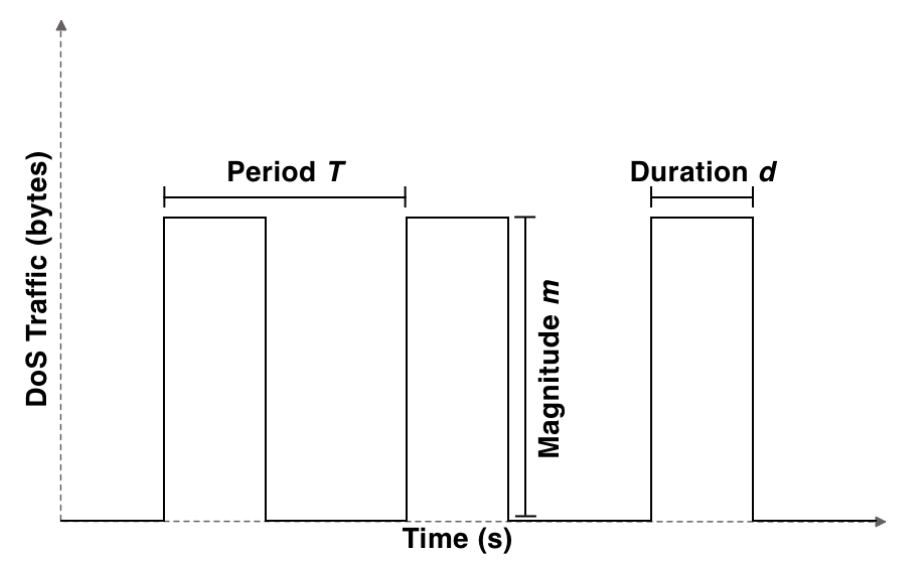

# Reproducing Low-Rate TCP-Targeted Denial of Service Attacks

 In this report, we reproduce the main findings of Low-Rate TCP-Targeted Denial of Service Attacks. This paper introduces the low-rate "shrew" Denial of Service attacks. Compared to high-rate TCP-targeted DoS attacks, shrew attacks are more dangerous, and more unlikely to be detected by TCP due to their low average rate attack. Whenever TCP recognises congestion in the network, it doubles the retransmission timeout(RTO) starting at an RTO value of 1 second, resends the packet and waits for the timeout. During this time period, attacker can throttle the network with large enough TCP flow causing the retransmitted packet to drop. Sender doubles the RTO again and tries to retransmit. 

 The shrew attacks are of two-level periodic square wave stream in which the attacker transmits bursts of duration l and rate R in a deterministic on-off pattern that has period T. In the paper, the outages are created at times 3,7,15,... to successfully launch the attack while avoiding being detected.
 

 
 
We use Mininet on Amazon EC2 to simulate a simple network of legitimate sender, host and an attacker on a bottleneck link of bandwidth 1mbps. By tuning various parameters, we re-create the results in this paper. We test the low-rate DoS attacks in four scenarios as depicted in the graph below which shows zero throughput for sender up until a square-waveperiod of approximately 1200 m. We also demonstrate the attack using various TCP variants to show the effectiveness of the attack.

<!--  -->
