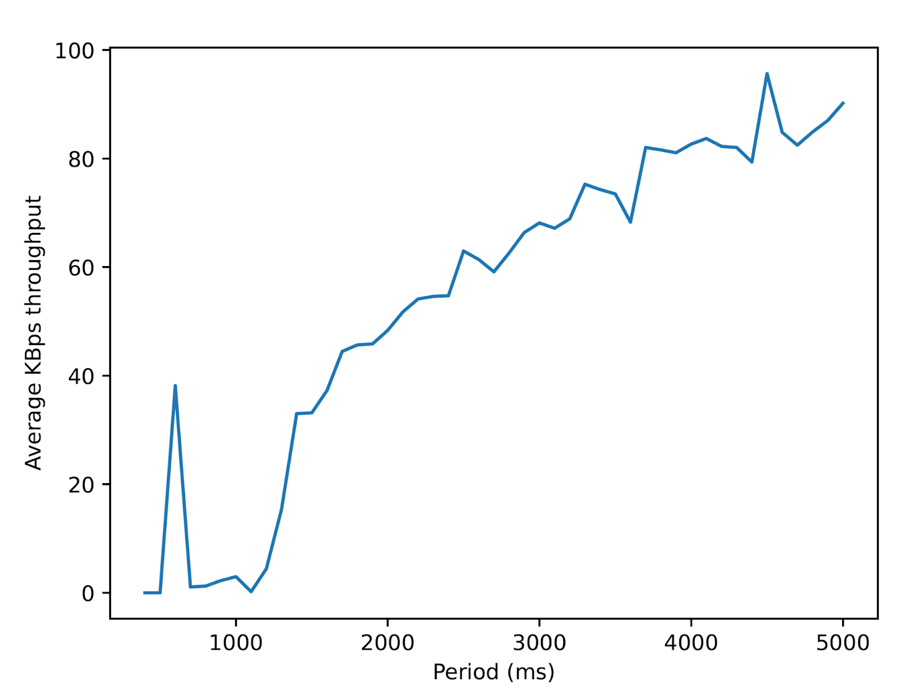
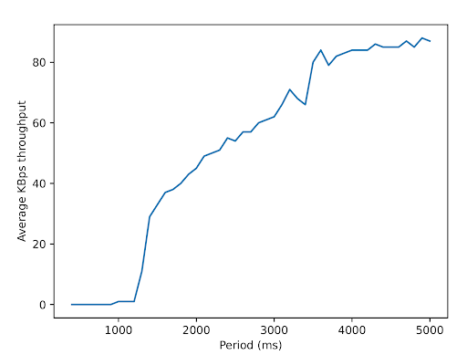
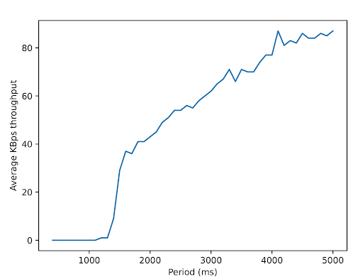
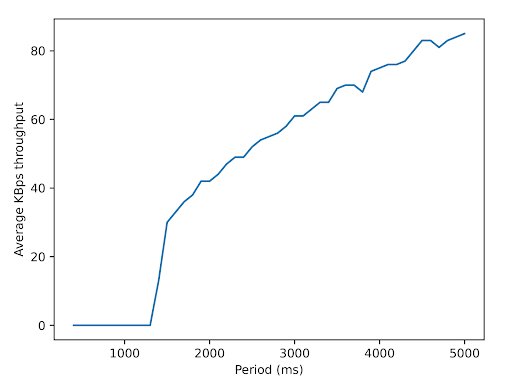

# Reproducing Low-Rate TCP-Targeted Denial of Service Attacks

 In this report, we reproduce the main findings of Low-Rate TCP-Targeted Denial of Service Attacks. This paper introduces the low-rate "shrew" Denial of Service attacks. Compared to high-rate TCP-targeted DoS attacks, shrew attacks are more dangerous, and more unlikely to be detected by TCP.
 
 By using Mininet to create a simulated network, designing network layout, and choosing our own network bandwidth and delay, we re-create the results in this paper.

 We test the low-rate DoS attacks in four scenarios.

> Link to GitHub repo: 
> https://github.com/Aplank14/dos-shrew
> 
